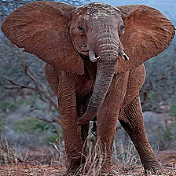
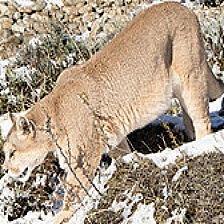

# Spatiotemporal Wildlife Classification Organization

Welcome to the Spatiotemporal Wildlife Classification (SWC) Organization. 
This organization was created to serve as a central hub for all tools and processes created in the fulfillment of 
the thesis study on: _A Novel use of Spatiotemporal Metadata to Bolster Wildlife Classification_.

This organization serves to provide open source documentation and insights into the processes used, to further the 
domain of wildlife classification. 

Each of the topics within the organization structure, provides a sneak-peak into the repository documentation, as well 
as a direct link to the relevant documentation.

## Thesis Report
This link provides direct access to download the resulting report on the investigation into [_A novel use of Spatiotemporal Metadata to Bolster Wildlife Classification_](resources/spatiotemporal_wildlife_classification_version_2_v2_website.pdf)

## Organization Structure

### [Wildlife Classification](https://spatiotemporal-wildlife-classification.github.io/Wildlife-Classification/)
The global extent of social media, camera traps, and citizen science has the potential to provide 
a real-time global wildlife overview reaching to the furthest corners of the globe.

Automated wildlife classification is essential within ecological studies, wildlife conservation and management, 
specifically fulfilling the roles of species population estimates, individual identification, and behavioural patterns.
However, due to the harsh environments, variable image quality, and long-tail data distribution, traditional 
wildlife classification methods struggle to achieve top performance. 

Existing studies have successfully used metadata to boost the performance of image classification. 
Additionally, the taxonomic structure of metadata falls into the cascading classifier domain. 
The findings of previous studies, lead to the investigation of how taxonomic levels influence the performance 
of metadata and image classification models. Further, how can the determined trends be leveraged within a novel 
cascading ensemble classifier utilizing both metadata and image classification components to improve upon traditional 
methods.

The proposed research questions include:

1. How does taxonomic level influence the performance of metadata classification?
2. How does taxonomic level influence the performance of image classification?
3. How does the novel cascading ensemble method improve upon baseline classifiers?

### [Animal Detector](https://spatiotemporal-wildlife-classification.github.io/Animal-Detector/)
This repository performs the observation image pre-processing. 
The pre-processing includes downloading the raw observation images from the iNaturalist urls. 
Each image is subjected to the [Mega-detector](https://github.com/microsoft/CameraTraps/blob/main/megadetector.md) YOLO5 object-detection model, capable of detecting animals within an image 
and placing bounding-boxes. Each animal detection is cropped and forms a sub-image with image enhancement to maintain resolution.
The resulting sub-images form a training and validation dataset constructed using a taxonomic directory structure to facilitate 
image classification training in the [Wildlife Classification](https://spatiotemporal-wildlife-classification.github.io/Wildlife-Classification/) repository.

### [Binary Image Labelling](https://spatiotemporal-wildlife-classification.github.io/Binary-Image-Labelling/)
This repository offers a simple binary image processor. 
Its primary use cases involved the possibilities of hand-labelling observation image quality or animal presence in order to train a model
to detect whether an image was of sufficient quality or contained wildlife to be used as training or validation data. 
This was created before the use of the [Animal Detector](https://spatiotemporal-wildlife-classification.github.io/Animal-Detector/)

### [Distributed Scraping Network](https://spatiotemporal-wildlife-classification.github.io/Distributed-Scraping-Network/)
This API is created to run on a server, providing a central means of distributing and collecting weather data from
Open-Meteo. 
This server provides a means of accessing and running a DSN leaf node at any computer. 
This allows collection to occur externally running from a form of cloud computing. 
This allows you to keep your computer free to work on other topics while data collection occurs.

This API is run in combination with results obtained from [Spatiotemporal Wildlife Classification](https://trav-d13.github.io/spatiotemporal_wildlife_classification/) and [DSN Leaf](https://spatiotemporal-wildlife-classification.github.io/DSN-Leaf/).

### [DSN Leaf](https://spatiotemporal-wildlife-classification.github.io/DSN-Leaf/)
This repository serves to provide a leaf node within the [Distributed Scraping Network (DSN)](https://spatiotemporal-wildlife-classification.github.io/Distributed-Scraping-Network/). 
The DSN provides a central point of communication for the leaf node through the use of a [FastAPI](https://fastapi.tiangolo.com/).
The leaf node communicates with the central DSN to determine essential wildlife observation details, 
required to make a weather data request to the Open-Meteo historical API. Once the data is retrieved, the leaf node formats the collected data, and posts it back to the central DSN for collection and storage. 

In summary, the leaf node collects the weather/ metadata for each observation and transfers it to a central storage. 
This enables the creation of the [Spatiotemporal Wildlife Classification's](https://trav-d13.github.io/spatiotemporal_wildlife_classification/) novel dataset, specifically the metadata values.

## Favourites Gallery 

  
  
  
  
  

  
  
  
  
  

  
  
  
  
  

  
  
  
  
  

  
  
  
  
  

_The above images are sourced from the Dataset [DOI: 10.34740/kaggle/dsv/5939843](https://www.kaggle.com/datasets/travisdaws/spatiotemporal-wildlife-dataset). 
All attributions go to [iNaturalist](https://www.inaturalist.org/). The original source of the wildlife observation images._

